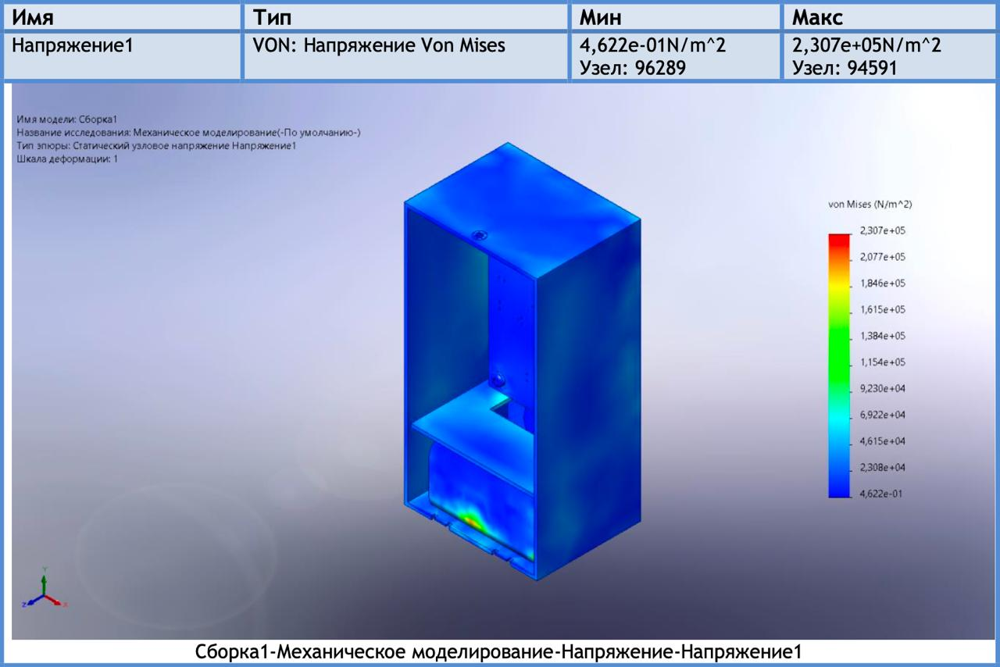
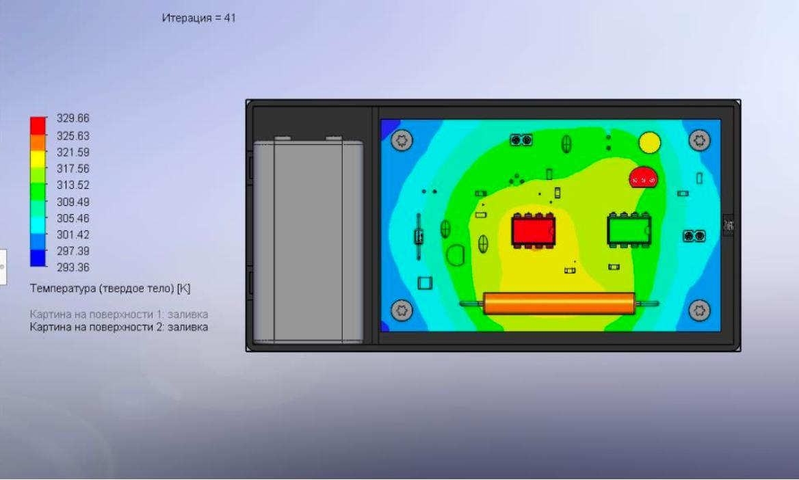
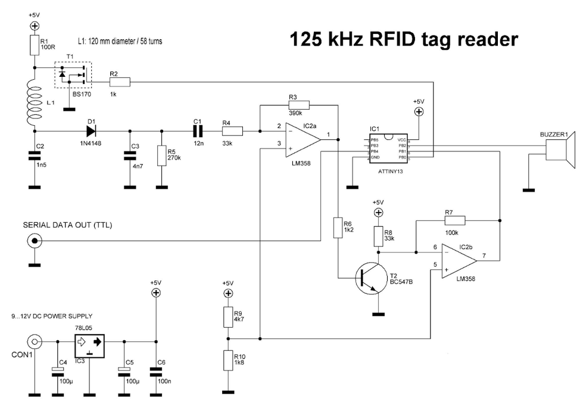
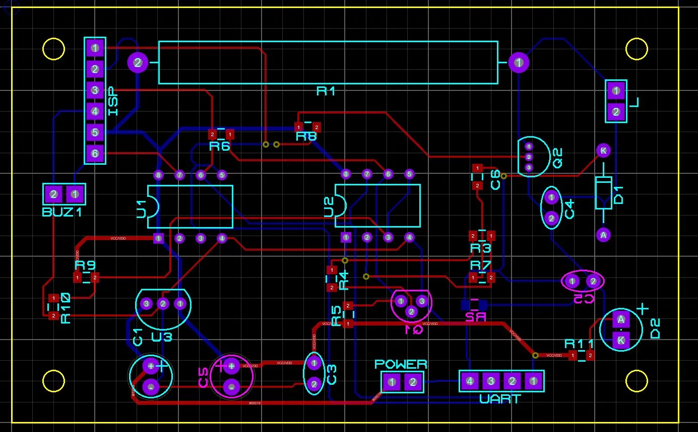

# Технические характеристики

## Основные параметры

*Таблица 1 — Технические характеристики*

| Параметр | Значение |
|---|---|
| Протокол считывания | EM4100 (Manchester, 64-bit, только чтение) |
| Рабочая частота | 125 кГц ± 3 кГц |
| Дальность считывания | 3–8 см |
| Время считывания одной метки | не более 0,5 с |
| Интерфейс вывода данных | UART TTL, 9600 бод |
| Формат выходных данных | Уникальный ID метки, десятичное число |
| Напряжение питания | 9 В («Крона») |
| Напряжение питания МК | 5 В ± 5 % (78L05) |
| Потребляемая мощность | ~0,6 Вт |
| Ток потребления | не более 150 мА при 9 В |
| Микроконтроллер | ATtiny13, 8-бит AVR, RC 9,6 МГц |
| Диаметр катушки | 120 мм, 58 витков |
| Класс защиты от поражения током | 3 (БСНН, ГОСТ 12.2.007.0-75) |
| Степень защиты оболочки | IP20 (ГОСТ 14254-96) |
| Температура эксплуатации | 0…+40 °C |
| Материал корпуса | Поликарбонат (PC), ρ = 1 190 кг/м³ |
| Габариты корпуса | не более 200 × 200 × 50 мм |

## Показатели надёжности

По результатам расчёта (ОСТ 4Г 0.012.242-84):

| Показатель | Значение |
|---|---|
| Суммарная интенсивность отказов Λ | 2,928 · 10⁻⁶ ч⁻¹ |
| Наработка на отказ T₀ | ≈ 341 472 ч |
| Вероятность безотказной работы за 10 000 ч | 0,9711 |
| Вероятность безотказной работы за 50 000 ч | 0,8638 |
| Гамма-процентная наработка T₀,₉ (γ = 0,9) | ≈ 35 978 ч |
| Среднее время восстановления | не более 30 мин |

Наибольший вклад в суммарную интенсивность отказов вносят пьезозуммер BUZZER, электролитические конденсаторы C1, C2 и паяные соединения (по 13–17 % каждый).

## Результаты механического моделирования

Статический анализ выполнен в SolidWorks Simulation.

*Рисунок 2 — Карта напряжений Von Mises*

| Параметр | Значение |
|---|---|
| Максимальное напряжение Von Mises | 2,307 · 10⁵ Н/м² |
| Максимальное перемещение | 2,436 · 10⁻³ мм |
| Собственная частота печатного узла | ≈ 946 Гц (норма ≥ 200 Гц) |

Максимальное напряжение (230,7 кПа) значительно ниже предела текучести поликарбоната (~40 МПа).

## Результаты теплового моделирования

Тепловое моделирование выполнено в SolidWorks Flow Simulation.

*Рисунок 3 — Тепловая карта сборки*

| Параметр | Значение |
|---|---|
| Средняя температура поверхности | 304,16 К (31,0 °C) |
| Максимальная температура (зона R1) | 329,66 К (56,5 °C) |
| Температура окружающей среды | 293,15 К (20,0 °C) |

## Схема электрическая принципиальная

*Рисунок 4 — Схема электрическая принципиальная*

Основные узлы:

- **Колебательный контур** (L1, C1, C2) — формирует поле 125 кГц;
- **Усилитель** (Q1 BC547A, LM358) — усиливает и детектирует сигнал с метки;
- **ATtiny13** — декодирует Manchester и выводит ID по UART через PB4;
- **78L05** (SOT-89) — стабилизатор 5 В для МК и аналоговой части;
- **LED** (PB3 через R11) — индикатор питания; **BUZZER** (PB2) — сигнал при успешном считывании.

## Топология печатной платы

*Рисунок 5 — Топология печатной платы (DipTrace)*
