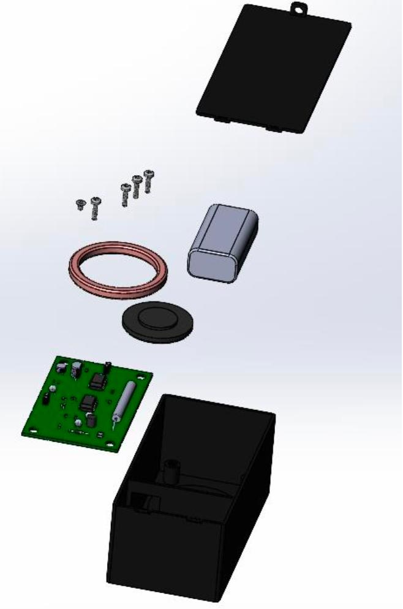

# Состав изделия

## Конструктивный состав

- нижняя часть корпуса (поликарбонат);
- крышка корпуса (поликарбонат);
- печатный узел (плата 80 × 50 мм + 25 покупных ЭРЭ);
- катушка считывателя (∅120 мм, 58 витков);
- батарея 9 В типа «Крона»;
- стойки M2.5 × 10 мм для крепления платы;
- 1 винт M2.5 × 4 мм для крышки.

*Рисунок 6 — Разнесённый вид сборки (SolidWorks)*

## Показатели стандартизации и унификации

По результатам расчёта (ГОСТ 3.1118-82):

| Показатель | Значение |
|---|---|
| Общее число составных частей N | 27 шт. |
| Общее число типоразмеров n | 23 шт. |
| Покупных ЭРЭ (типоразмеров / деталей) | 21 / 25 шт. |
| Оригинальных элементов | 2 шт. (плата + катушка) |
| Кпр(пок.) — коэфф. применяемости покупных | 91,30 % |
| Кпр(ориг.) — коэфф. применяемости оригинальных | 8,70 % |
| Кпр(с) — по стоимости | 65,66 % |
| Кп — коэффициент повторяемости | 1,17 |
| Стоимость покупных ЭРЭ | 982 руб. |
| Стоимость платы (заказ 12 шт.) | 513,5 руб./шт. |

## Перечень элементов печатного узла

*Таблица 2 — Покупные ЭРЭ (25 компонентов, 21 типоразмер)*

| Поз. | Наименование / Тип | Кол. | Монтаж | Примечание |
|---|---|---|---|---|
| R1 | Резистор SQP 10 Вт, **10 Ом**, 5 %, проволочный | 1 | THT | — |
| R2 | Резистор 0805, 270 кОм, 5 % | 1 | SMD | — |
| R3 | Резистор 0805, 390 кОм, 5 % | 1 | SMD | — |
| R4, R8, R10 | Резистор 0805, 1 кОм, 5 % (RC0805JR-071KL) | 3 | SMD | — |
| R5, R7 | Резистор 0805, 33 кОм, 5 % | 2 | SMD | — |
| R6 | Резистор 0805, 100 кОм, 5 % (RC0805JR-07100KL) | 1 | SMD | — |
| R9 | Резистор 0805, 3 кОм, 5 % | 1 | SMD | — |
| R11 | Резистор 0805, 330 Ом, 5 % (RC0805JR-07330RL) | 1 | SMD | — |
| C1, C2 | Конденсатор 100 мкФ, 100 В, Al электролит. (JRB2A101M05) | 2 | THT | **Полярность** |
| C3 | Конденсатор CM-100N-Y5V, 100 нФ, 50 В, MLCC | 1 | SMD | — |
| C4 | Конденсатор 1 нФ, 50 В, NP0, выводной | 1 | THT | — |
| C5 | Конденсатор JYAA2472MCF095000B, 4,7 нФ, 300 В AC, Y2 | 1 | THT | — |
| C6 | Конденсатор 0805N123J250, 12 нФ, 25 В, C0G | 1 | SMD | — |
| Q1 | Транзистор BC547A, NPN, TO-92 | 1 | THT | Цоколёвка B/C/E |
| Q2 | Транзистор BS170, N-канал, TO-92 | 1 | THT | Цоколёвка G/D/S |
| D1 | Диод 1N4148, DO-35 | 1 | THT | **Полярность** (полоса = катод) |
| 78L05 | Стабилизатор 5 В, SOT-89 | 1 | SMD | **Ключ** |
| LM358 | ОУ двухканальный, DIP-8 | 1 | THT | В панель, **ключ** |
| ATTINY13 | МК 8-бит AVR, DIP-8 | 1 | THT | В панель, **ключ** |
| BUZZER | Пьезозуммер | 1 | THT | **Полярность** |
| LED | Светодиод L-7113ID, красный, D 5 мм | 1 | THT | Длинный вывод = анод (+) |

## Разъёмы и органы управления

*Таблица 3 — Разъёмы и органы управления*

| Обозначение | Назначение | Примечание |
|---|---|---|
| SW1 | Тумблер питания «ВКЛ/ВЫКЛ» | — |
| J_UART | UART TTL, 9600 бод | Вывод ID меток на ПК |
| J_ISP | ISP для прошивки ATtiny13 | avrdude / USBasp |
| J_PWR | Питание 9 В («Крона») | Соблюдать полярность |
| LED | Индикатор питания (красный) | Горит при SW1 = «ВКЛ» |
| BUZZER | Звуковой сигнал считывания | Сигнал при успешном чтении |
