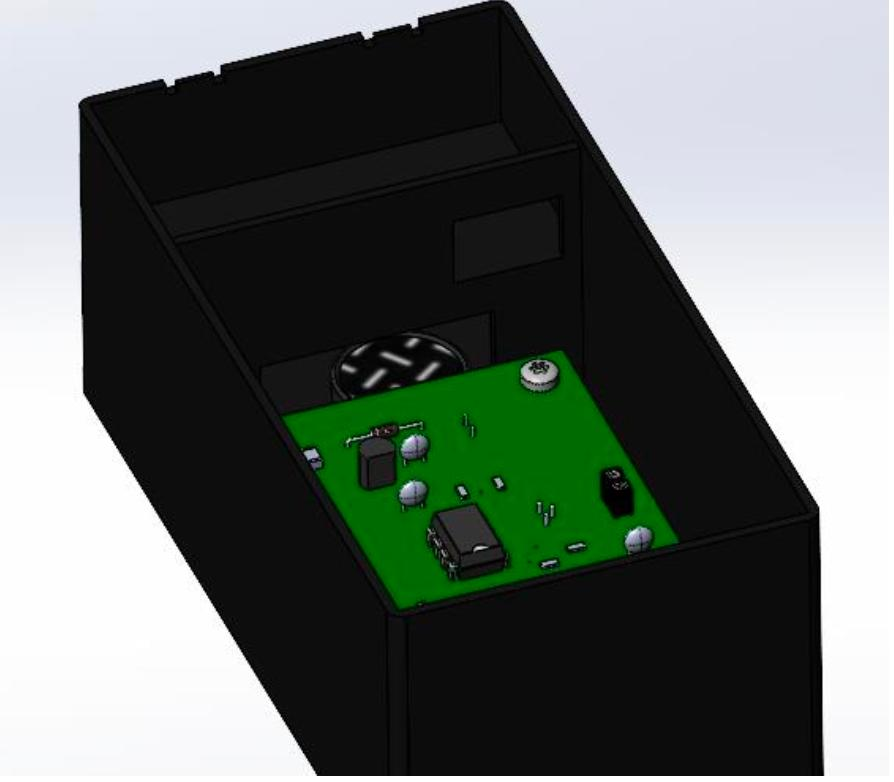

# RFID-считыватель

**Обозначение:** МИЭМ.469435.001 РЭ  
**ИЭТР 3 класса** — Р 50.1.029, ГОСТ Р 54088-2017

---

*Рисунок 1 — RFID-считыватель. Итоговая сборка (SolidWorks)*

---

## Краткое описание

Считыватель меток RFID по протоколу EM4100 на частоте 125 кГц. Уникальный идентификатор метки выводится через UART (9600 бод) на подключённый компьютер. Питание — от батареи 9 В («Крона»).

| Параметр | Значение |
|---|---|
| Протокол | EM4100, 125 кГц |
| Дальность считывания | 3–8 см |
| Интерфейс | UART TTL, 9600 бод |
| Микроконтроллер | ATtiny13, внутренний RC 9,6 МГц |
| Питание | 9 В («Крона») |
| Расчётная наработка на отказ | ≈ 341 472 ч |

## Разделы руководства

- [Общие сведения](01_general.md)
- [Технические характеристики](02_technical_specs.md)
- [Меры безопасности](03_safety.md)
- [Состав изделия](04_components.md)
- [Сборка и монтаж](05_assembly.md)
- [Прошивка микроконтроллера](06_firmware.md)
- [Эксплуатация](07_operation.md)
- [Техническое обслуживание](08_maintenance.md)
- [Возможные неисправности](09_troubleshooting.md)

---

*Разработчик: Серов И. А., Левитская Д. Ю., Енушкевич В. В. — группа БИВ 238, МИЭМ НИУ ВШЭ, 2025*  
*Заказчик: Полесский С. Н.*
